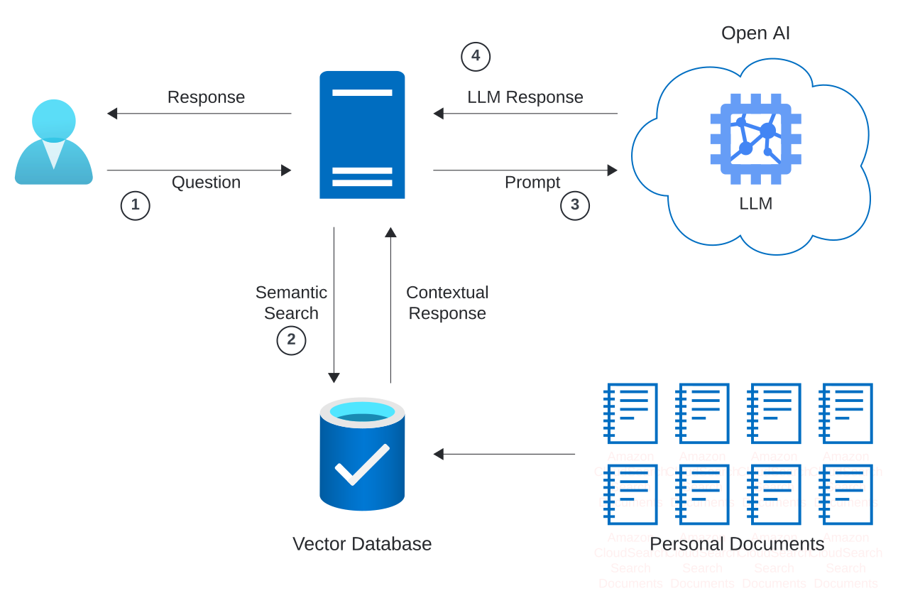

# RAG-Based Chatbot

Welcome to my RAG-based chatbot project! This chatbot uses Retrieval-Augmented Generation (RAG) with OpenAI's language model to provide detailed information about myself, beyond what's available in my resume or LinkedIn profile.

## Overview

This project leverages the capabilities of OpenAI's LLM (Large Language Model) combined with my personal data to offer a more comprehensive understanding of my background, skills, and experiences.

## Features

- **Personalized Responses**: The chatbot is trained with my resume and additional personal information, enabling it to answer questions about my professional journey, skills, and experiences.
- **Interactive Learning**: Users can ask questions to learn more about me in a conversational manner.
- **Enhanced Information**: Provides insights that are not available in my traditional resume or LinkedIn profile.

## Project Architecture
### How the AI-Powered Chatbot Works


1. **Understanding Your Questions:**
    - When you ask the chatbot a question, it first understands what specific information you are looking for. For example, you might ask, "What was your role at Techsee?"

2. **Finding Relevant Information:**
    - **Searching My Documents:** The chatbot searches through my resume and additional documents that contain detailed information about my professional experience, skills, and projects.
    - **Selecting Key Details:** It identifies and selects the most relevant sections from these documents to answer your question accurately.

3. **Generating a Detailed Response:**
    - **Combining Information:** The selected details are then used to generate a complete and coherent response. This ensures that the answer you receive is both accurate and informative, based on the actual content of my resume and other documents.


### Architecture of the RAG-Based Chatbot



The chatbot is built using a Retrieval-Augmented Generation (RAG) architecture. It uses LlamaIndex library. Here’s a brief overview of how it works:
1. **Document Indexing**
    - **Storing documents in Vector Database:** A dedicated route is utilized for uploading my resume along with various other files containing additional information about me that is not included in my resume. These files are then processed into a VectorStoreIndex.

2. **Query Understanding:**
    - **Natural Language Processing (NLP):** The chatbot uses advanced NLP techniques to understand your question and determine the key information it needs to find.

3. **Information Retrieval:**
    - **Document Search:** The chatbot performs a search through these uploaded documents to find the most relevant pieces of information.
    - **Retrieval Model:** A retrieval model is employed to rank and select the best matching document snippets based on your query.

4. **Response Generation:**
    - **Language Model:** The OpenAi language model is used to generate a coherent and detailed response by combining the retrieved information with its own language understanding capabilities.
    - **Answer Formulation:** The model formulates a complete answer that accurately addresses your query, providing detailed and contextually relevant information.

### Uploading Documents

To keep the chatbot up-to-date, I regularly upload my resume and other professional documents to the system. This ensures that the chatbot has access to the latest and most accurate information about my career and skills.

## Setup and Installation

1. **Clone the Repository**

    ```bash
    git clone https://github.com/orenku/chat-with-me

    cd chat-with-me
    ```

2. **Install Dependencies**

    Make sure you have [Node.js](https://nodejs.org/) and [npm](https://www.npmjs.com/) installed. Then, install the required dependencies:

    ```bash
    npm install
    ```

3. **Set Up OpenAI API Key**

    Create a `.env` file in the root directory and add your OpenAI API key:

    ```env
    OPENAI_API_KEY=your_openai_api_key
    ```

4. **Start the Application**

    ```bash
    npm start
    ```

## Usage

Once the application is running, you can interact with the chatbot via the provided web interface. Ask questions about my professional background, experiences, and skills to get detailed and personalized responses.

## Examples

- **Question**: "What technologies have you worked with?"  
  **Answer**: "I have extensive experience with React, React Native, NodeJS, and other technologies as mentioned in my resume."

- **Your Question:** "What were your responsibilities at Techsee?"
- **Chatbot’s Response:** "At Techsee, I worked as a Fullstack Developer from 2021 to 2023. I was involved in Fullstack projects utilizing React, Typescript, and Node, collaborating cross-functionally with developers, designers, and product managers. I explored new technologies and partnerships, including MVP integrations aimed at testing current product assumptions, and developed styled components using React (Typescript)."

## Contributions

Contributions are welcome! Please fork the repository and submit a pull request with your changes. For major changes, please open an issue first to discuss what you would like to change.

## License

This project is licensed under the MIT License - see the [LICENSE](LICENSE) file for details.

## Contact

For any questions or inquiries, please contact me via my LinkedIn profile or through the chatbot.


## Getting Started
This is a [Next.js](https://nextjs.org/) project bootstrapped with [`create-next-app`](https://github.com/vercel/next.js/tree/canary/packages/create-next-app).

First, run the development server:

```bash
npm run dev
# or
yarn dev
# or
pnpm dev
# or
bun dev
```

Open [http://localhost:3000](http://localhost:3000) with your browser to see the result.
